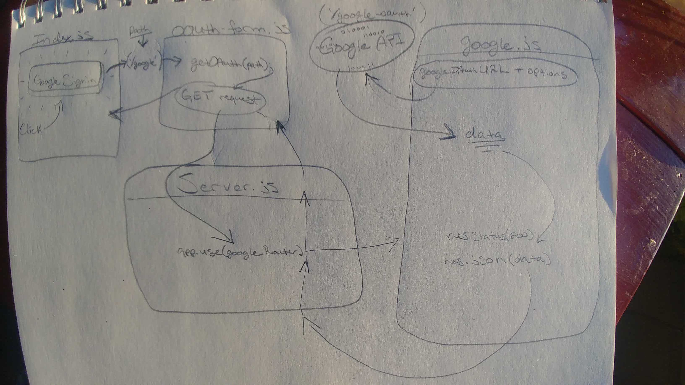

# LAB - 11

## API Server

### Author: James Dunn

### Links and Resources

- [submission PR](https://github.com/james-401-advanced-javascript/lab-11/pull/1)
- [travis](https://travis-ci.com/james-401-advanced-javascript/lab-11)
- [front-end](https://jamesdunn-lab-11.herokuapp.com)

### README Questions

- Now that we have some data about the user, how would we go about adding this user to our database? What data should we save? What data is missing? What considerations about storing this data do we need to take?

  - We would want to save the username and email. If we use Mongoose, that will create an id. We may also want to save the token or authenticated URL, so we can easily retreive the information from Google again in the future. Any additional saved information would depend on our application uses. Any sensitive data should obviously be encripted before storing it in the database.

  - If the password has been modified/set, then hash password before storing entry in db

- What are the pros and cons of setting res.cookie?

  - **Pros**:
    We can store only the token key in the cookie rather than user data
    The user won't have to continually re-login as long as his/her token is valid
  - **Cons**:
    Storing token data in cookies leaves the server open to CSRF attacks

- Currently, the client is just sending us an object containing the username and password to us, which is why we can just pass along (req.body). What is a better way to do this?

  - A better way would be to encode the username and password send them in the header

### Modules

#### `model.js`

#### `users-model.js`

#### `404.js`

#### `error.js`

#### `auth-router.js`

#### `book- router.js`

#### `server.js`

##### Exported Values and Methods

###### `get(_id)`

###### `getFromField(query)`

###### `create(record)`

###### `update(_id, record)`

###### `delete(_id)`

###### `create(req, res, next)`

###### `authenticate(req, res, next)`

###### `setToken(req, res, next)`

###### `handleDelete(req, res, next)`

###### `populateTasks()`

### Setup

#### `.env` requirements

- `PORT`
- `MONGODB_URI`
- `JWT_SECRET`
- `HOME_URL`
- `GOOGLE_CLIENT_ID`
- `GOOGLE_CLIENT_SECRET`
- `GOOGLE_AUTH_SERVICE`
- `GOOGLE_TOKEN_SERVICE`
- `GOOGLE_API- GITHUB_CLIENT_ID`
- `GITHUB_CLIENT_SECRET`
- `GITHUB_AUTH_SERVICE`
- `GITHUB_TOKEN_SERVICE`
- `GITHUB_API`

#### Running the app

- `npm start`
- Endpoint: `index.js`

#### Tests

- How do you run tests?
- `npm test __tests__/`

#### UML

